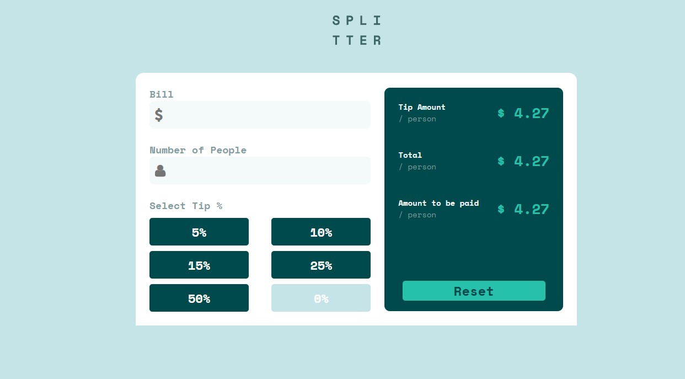
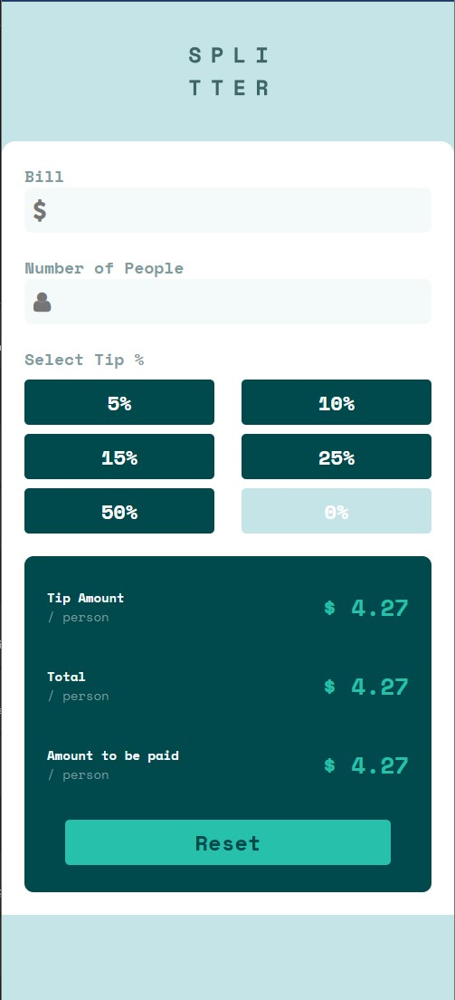

# Tip Calculator App
This is a solution based in the [Tip Calculator App Challenge on Frontend Mentor](https://www.frontendmentor.io/challenges/tip-calculator-app-ugJNGbJUX). If you want to improve your coding skills by building realistic projects, that's the place.

## Table of contents
- [Overview](#overview)
  - [The challenge](#the-challenge)
  - [Screenshot](#screenshot)
- [My process](#my-process)
  - [Built with](#built-with)
  - [What I learned](#what-i-learned)

## Overview

### The challenge
The challenge consisted of building a Tip Calculator, this means that the users must be able to input the value of their bill, the number of people with who they gonna divide the bill and the value of the tip.
As result, the calculator must shows the tip divided by the number of people, what i called by "Tip Amount", and the value of the bill also divided by the number of people, what I called by "Total".

I changed the design, by adding a field with the sum of the "Tip Amount" and "Total", what I called by "Amount to be paid / person", and also replaced the Custom Input for a 0% button.

### Screenshot

## My process

### Built with
- Semantic HTML5 markup
- CSS
- Javascript
- Mobile-first workflow
- Font Awesome

### What I learned
In this project I could improve my skills with HTML, CSS and Javascript, and also improve my skills with responsive design.

